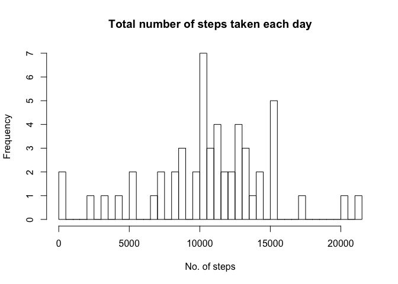
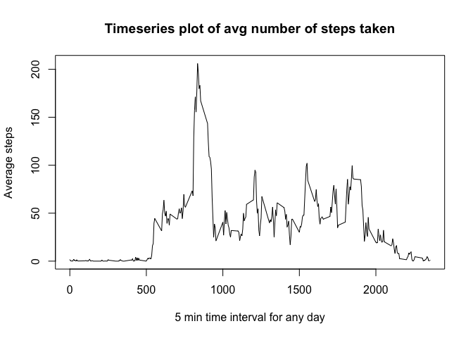
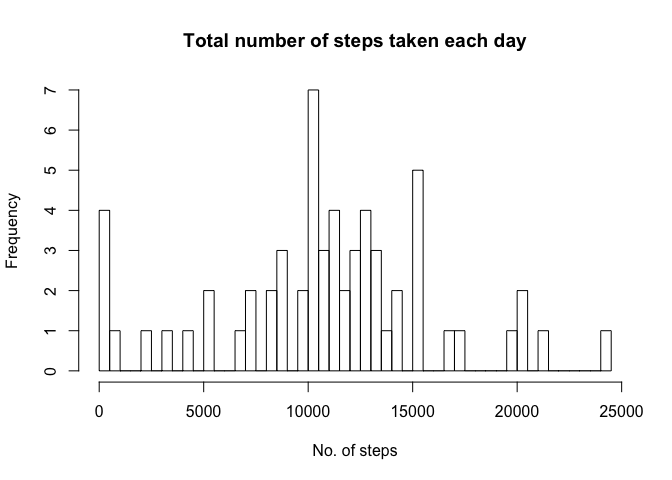
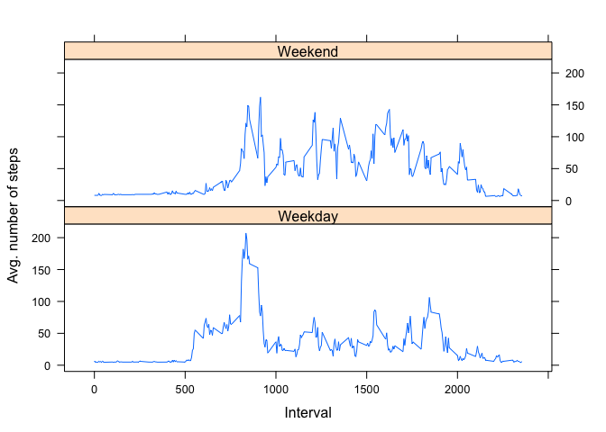

# Reproducible Research: Peer Assessment 1
##Load required libraries and setting configuration

```r
library(dplyr)
library(stats)
library(lattice)
options(scipen = 1, digits = 2)
```

## Unpack the data file in the git repositorylibra

```r
# Create if "analysis" folder does not exist
if(!file.exists("analysis")){
   dir.create("analysis",recursive = TRUE)    
}

unzip(zipfile = "activity.zip",
      overwrite=TRUE, exdir = "analysis")
```


## Loading and preprocessing the data

```r
#Loading activity data from data set file
activityData<-read.csv(file = file.path("analysis","activity.csv"))

#Creating new column as R Date object, derived from data column
activityData$rdate<-as.Date(activityData$date,"%Y-%m-%d")

#Summarizing data for plots by date
dailyData<-summarise_all(group_by(activityData[-2],rdate),funs(sum,mean))
```

#What is mean total number of steps taken per day?
## Histogram of the total number of steps taken each day

```r
#Plot histogram
hist(x=dailyData$steps_sum,breaks = 50,main = "Total number of steps taken each day",xlab = "No. of steps")
```

<!-- -->


```r
dailyMeanSteps<-mean(x=dailyData$steps_sum,na.rm = TRUE)
dailyMedianSteps<-median(x=dailyData$steps_sum,na.rm = TRUE)
```
The **mean** total number of steps taken per day is **10766.19** and the **median** for the same is **10765**

## What is the average daily activity pattern?

```r
#Aggregate the activity data for average steps by 5-min internval id (ignoring NA values)
avgStepsByInterval<-aggregate(steps ~ .,data=activityData[!is.na(activityData$steps),][-c(2,4)], mean)

#Plot time series 
plot(x = avgStepsByInterval$interval,y=avgStepsByInterval$steps,type = "l",main="Timeseries plot of avg number of steps taken",xlab="5 min time interval for any day",ylab="Average steps")
```

<!-- -->

```r
#Calculate max avg steps and corresponding interal for display in report
maxAvgSteps<-max(avgStepsByInterval$steps)
maxAvgStepsByInterval<-avgStepsByInterval$interval[maxAvgSteps]
```
The **1705** - 5-minute interval contains the maximum number of steps **206.17**.

## Imputing missing values

```r
#Calculate and store number of NA values in the activity data for steps
activityDataNA<-is.na(activityData$steps)
countNASteps<-sum(activityDataNA)

#Replacing NA values with the average for that 5-minute interval accross all the days
imputedMissingValActivityData<-activityData
imputedMissingValActivityData[activityDataNA,]$steps <- merge(activityData,avgStepsByInterval,by.x="interval",by.y="interval",all=TRUE)[activityDataNA,]$steps.y

#Plot histogram with new dataset
newDailyData<-summarise_all(group_by(imputedMissingValActivityData[-2],rdate),funs(sum,mean))
hist(x=newDailyData$steps_sum,breaks = 50,main = "Total number of steps taken each day",xlab = "No. of steps")
```

<!-- -->

```r
#Calculate mean and median with new dataset for display
newDailyMeanSteps<-mean(x=newDailyData$steps_sum,na.rm = TRUE)
newDailyMedianSteps<-median(x=newDailyData$steps_sum,na.rm = TRUE)
#
```
* No. of missing values in the dataset: 2304
* With the new dataset the **mean** total number of steps taken per day is **10889.8** and the **median** for the same is **11015**

## Are there differences in activity patterns between weekdays and weekends?

```r
#Aggregate the activity data for average steps by 5-min internval id (ignoring NA values)
imputedMissingValActivityData$dayOfWeek<-as.factor(ifelse(weekdays(imputedMissingValActivityData$rdate,abbreviate = TRUE) %in% c("Sun","Sat")==TRUE,'Weekend','Weekday'))

#Aggregate the average steps by interval accross all days
avgStepsByIntervalNewActivityData<-aggregate(steps ~ .,data=imputedMissingValActivityData[-c(2,4)], mean)

#Plot latice graph by Weekend and Weekday factors
xyplot(steps~interval|dayOfWeek,data=avgStepsByIntervalNewActivityData,type="l",xlab="Interval",ylab="Avg. number of steps",layout=c(1,2))
```

<!-- -->
